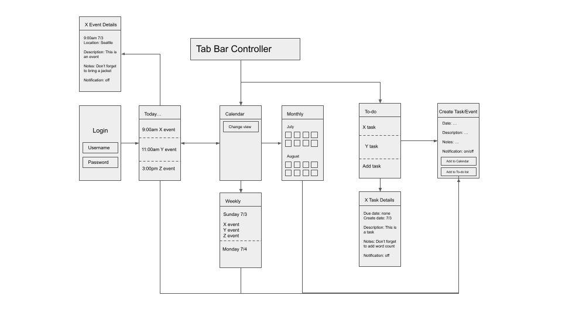

Calendar
===

## Table of Contents
1. [Overview](#Overview)
1. [Product Spec](#Product-Spec)
1. [Wireframes](#Wireframes)
2. [Schema](#Schema)

## Overview
### Description
Productivity app that connects schedules with calendars, tasks, and daily schedules. 

### App Evaluation
[Evaluation of your app across the following attributes]
- **Category:** Productivity
- **Mobile:** Convenient for users to record tasks and time commitments throughout the day. 
- **Story:** Users can record their schedules. The calendar lets users see what's coming up, a daily schedule lets the user view their current plan for the day, and to-do lists allows users to record tasks that they need to complete. 
- **Market:** The market for this app is primarily for anyone who has a busy schedule. In general, the app is for anyone who wants to stay more organized in terms of their tasks, meetings, and to-dos.
- **Habit:** The app is focused on daily use, so a user would open and use the app every day in order to stay on top of their schedule and tasks. The app would be habit forming since regular users would rely on the app to keep track of their schedule and calendar. 
- **Scope:** The scope of the app will start out more narrowly focused on features such as the calendar, schedule, and to-do list. The app can become more broad in the future, adding more productivity features for the user's convenience. 

## Product Spec

### 1. User Stories (Required and Optional)

**Required Must-have Stories**

* Calendar: Users can add things to a calendar 
* Schedule: Users can create a daily schedule and view their schedule of the day
* To-do list: Users can create a to-do list
* Reminders: Users can set reminders and notifications for scheduled items or tasks
* Login: Users can log in and log out to their account, and they can see calendars/schedules based on the account they are logged in to. 

**Optional Nice-to-have Stories**

* Calendar can be imported/exported from apple calendar and/or google calendar
* To-do list is organized by priority, and can be resorted by creation date, due date, etc.
* Users can share calendars/events with other users, and other users can accept invitations to these calendars/events
* Reminders screen where users can see upcoming reminders they set and change/remove them

### 2. Screen Archetypes

* Login screen
   * User logs in using their username and password
   * New users can also sign up on this screen
   * If a user is already logged in, the app opens on the next screen
* Daily schedule
   * Shows the schedule of the day
   * Blocked off by time, user can also create new events for theday
 * Calendar
   * Shows the month and upcoming events in the month
   * Also can switch to a view of the week
 * To-do list
   * List of tasks to do
   * Can also include priority/tags for what kind of task it is
 * Create event
   * Screen to create an event/add a task to the to do list

### 3. Navigation

**Tab Navigation** (Tab to Screen)

* Calendar/schedule
* To-do lists

**Flow Navigation** (Screen to Screen)

* Login Screen
   * Sign up and login buttons go to the daily schedule
* Daily Schedule
   * Navigate to the calendar or to-do list using tab bar navigation
   * Can also go to the create screen to add something to the daily schedule
* Calendar
   * Can switch between weekly and monthly view
   * Go to the create screen to add something to the calendar on a specific day
* To-do list
   * Can add a task by going to the create screen
* Create Screen
   * can reuse to edit existing events
   * Returns to the previous screen when the create screen is closed

## Wireframes

## Schema 
[This section will be completed in Unit 9]
### Models
[Add table of models]
### Networking
- [Add list of network requests by screen ]
- [Create basic snippets for each Parse network request]
- [OPTIONAL: List endpoints if using existing API such as Yelp]
